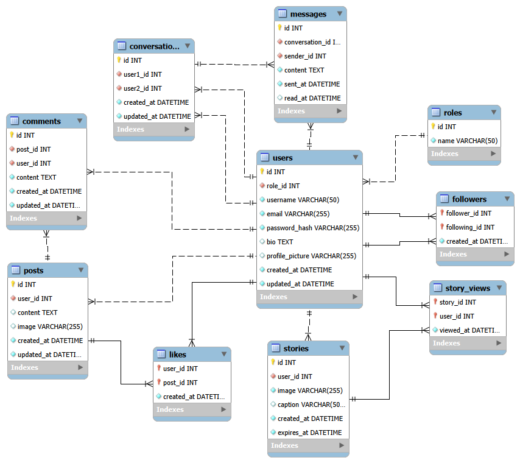

# Instagram Clone

A full-stack Instagram clone built with Flask, featuring JWT authentication, RESTful APIs, and a modern UI.

## Tech Stack
- Flask (Python web framework)
- SQLAlchemy (ORM)
- MySQL (Database)
- Flask-JWT-Extended (JWT Authentication)
- Jinja2 (Templating)
- HTML/CSS (Frontend)
- Pytest (Testing)

## Features
- User registration and login with JWT
- Create, edit, delete posts with images
- Like and comment on posts
- Follow/unfollow users
- Real-time messaging/inbox
- Stories (24h expiry)
- Search users and posts
- Admin dashboard
- REST API for all features
- Swagger/OpenAPI documentation

## Project Structure
```
├── app.py
├── .env
├── swagger.yaml
├── config/
├── models/
├── dao/
├── service/
├── controller/
│   ├── v1/          (Template controllers)
│   └── v2/          (REST API controllers)
├── templates/
├── static/
└── tests/
```

## Setup

1. Clone the repo
2. Create a virtual environment
3. Install dependencies: `pip install -r requirements.txt`
4. Create a `.env` file with the following variables:
   - `SECRET_KEY`
   - `JWT_SECRET_KEY`
   - `DATABASE_URL`
   - `UPLOAD_FOLDER`
   - `MAX_CONTENT_LENGTH`
5. Create a MySQL database named `project1`
6. Run the application: `python app.py`

## API Documentation
The API documentation is available in `swagger.yaml` and can be imported into Swagger UI or Postman.

## Running Tests
Run the tests using pytest:
```bash
pytest
# or
pytest tests/
```

## ER Diagram

